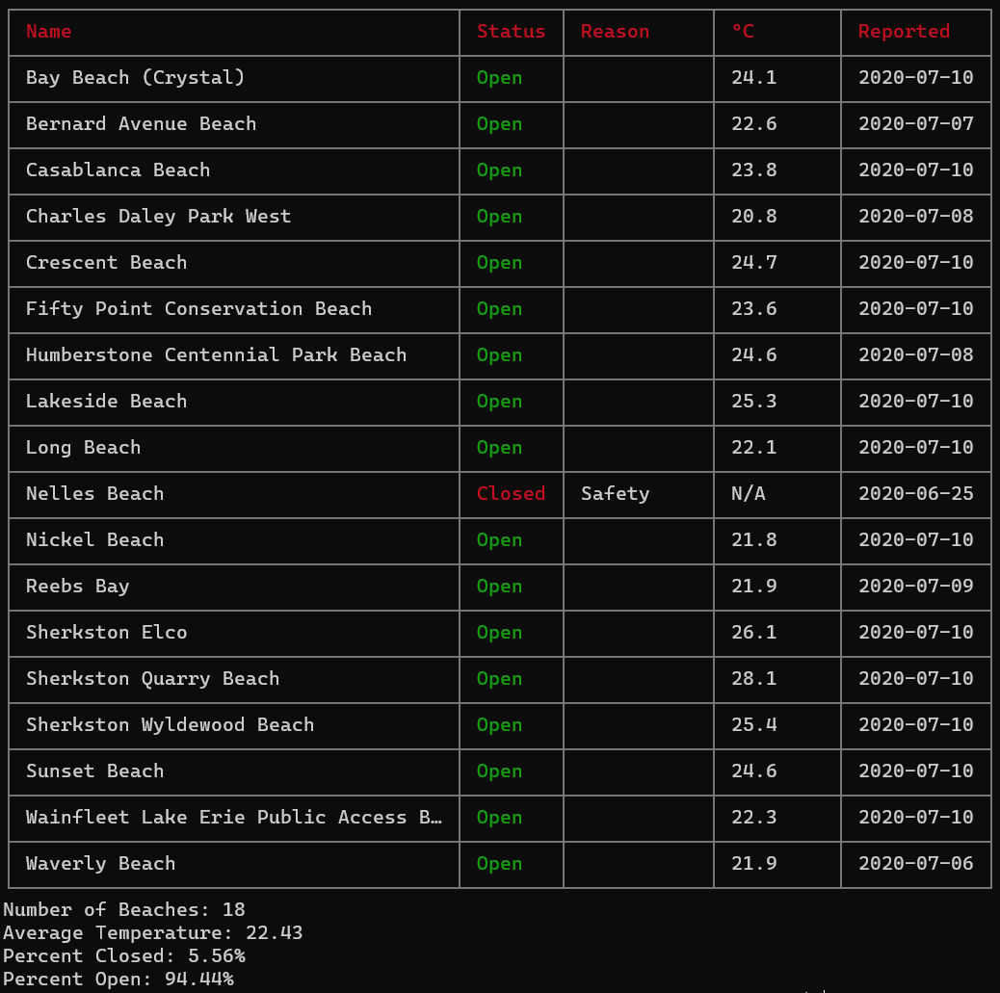

# Niagara Beaches

> Fetch the latest Niagara beach monitoring data. Includes CLI!

This is a small package that can be used to fetch the latest beach monitoring data for Beaches in the Niagara Region. It includes a CLI so you can check the water quality and temperatures for each beach from your terminal.

The beaches reported on here are not monitored year round and the feed that this package pulls from can be changed or discontinued at any time so check the dates.

## History of this Package

This was one of the first projects I made in NodeJS. It's a toy project and not to be relied upon. It's updated very infrquently.

## Using Niagara Beaches in Your Project

### Installation

```
npm install niagara-beaches
```

### Usage

```javascript
const niagaraBeaches = require("niagara-beaches");
niagaraBeaches
  .fetchAll()
  .then((beaches) => {
    console.log(beach);
  })
  .catch((error) => {
    console.error(error);
  });
```

## Using the Niagara Beaches CLI

### Installation

Install the package globally:

```
npm install niagara-beaches -g
```

### Usage

From the terminal type: `niagara-beaches` and hit enter.

You should see output like this:



### License

Copyright (c) 2012-2020 Nickolas Kenyeres <nickolas@knicklabs.com>

Permission to use, copy, modify, and/or distribute this software for any purpose with or without fee is hereby granted, provided that the above copyright notice and this permission notice appear in all copies.

THE SOFTWARE IS PROVIDED "AS IS" AND THE AUTHOR DISCLAIMS ALL WARRANTIES WITH REGARD TO THIS SOFTWARE INCLUDING ALL IMPLIED WARRANTIES OF MERCHANTABILITY AND FITNESS. IN NO EVENT SHALL THE AUTHOR BE LIABLE FOR ANY SPECIAL, DIRECT, INDIRECT, OR CONSEQUENTIAL DAMAGES OR ANY DAMAGES WHATSOEVER RESULTING FROM LOSS OF USE, DATA OR PROFITS, WHETHER IN AN ACTION OF CONTRACT, NEGLIGENCE OR OTHER TORTIOUS ACTION, ARISING OUT OF OR IN CONNECTION WITH THE USE OR PERFORMANCE OF THIS SOFTWARE.
